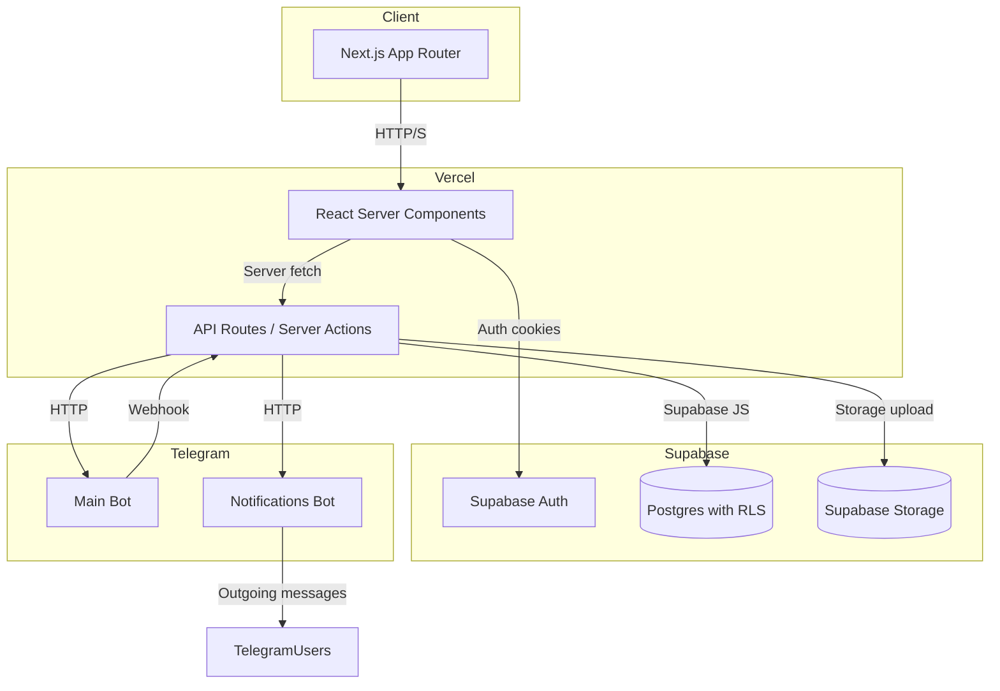
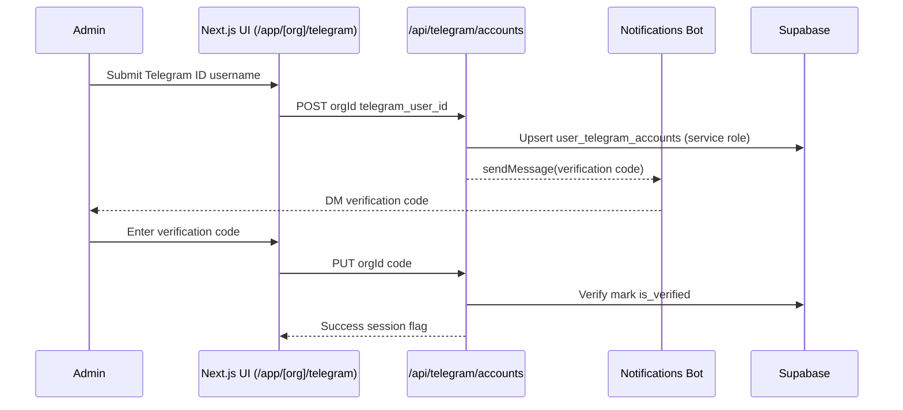

# Orbo 1.1 Functional Audit (November 2025)

## 1. Executive Summary
- **Architecture**: Single Next.js 14 application (App Router) hosted on Vercel with Supabase for auth/database. Telegram bots are driven through `/api/telegram/*` routes using long-lived service-role clients.
- **Strengths**: Mature Supabase schema covering organizations, participants, materials, events, and Telegram analytics. Rich admin UI for members, dashboard, and Telegram operations. Event processing pipeline normalizes updates and tracks activity events.
- **Key gaps**: Widespread service-role usage inside server components/API routes bypasses RLS; payments are unimplemented; webhook processing lacks idempotency and rate limiting; observability and test coverage are minimal; Supabase type definitions are stale relative to migrations.
- **Strategic alignment**: Matches MVP focus on Telegram-first CRM and events, but corporate offboarding, growth hooks, and marketplace scaffolding remain conceptual. This audit now maps directly to `docs/ROADMAP_FINAL_NOV15_2025.md` (solo execution cadence) so that stabilization/security fixes block any Wave 1 scope.

## 2. High-level Architecture


### Telegram Update Flow
```mermaid
flowchart LR
  Telegram[Telegram Update] --> Webhook[/api/telegram/webhook]
  Webhook -->|secret check  async| Recovery[webhookRecoveryService]
  Webhook -->|service-role| EnsureGroup[ensureGroupRecord]
  EnsureGroup --> OrgMap[org_telegram_groups]
  Webhook -->|if mapped| EventSvc[eventProcessingService.processUpdate]
  EventSvc --> Activity[(activity_events)]
  EventSvc --> Participants[(participants, participant_groups)]
  EventSvc --> Metrics[(group_metrics)]
  Webhook -->|commands/auth codes| AuthSvc[telegramAuthService]
  Webhook --> Response[200 OK]
```

### Nov 15 Architecture Findings
- **Webhook privilege creep**: `/api/telegram/webhook` instantiates a global Supabase client with the service-role key (`supabaseServiceRole`), auto-inserts any new group into `telegram_groups`, and only later checks whether `org_telegram_groups` has a mapping before processing events. If a tenant misconfigures group assignments, updates still mutate global tables under the service role, so leaked metadata is possible.
- **Missing idempotency**: `lib/services/eventProcessingService.ts` explicitly documents that `telegram_updates` was removed in migration 42 and "Idempotency is not currently implemented", meaning duplicate updates will replay joins/leaves and skew metrics whenever Telegram retries.
- **Server components with service role**: `lib/server/supabaseServer.ts` exposes `createAdminServer()` which returns a service-role client and is consumed by dashboards and API routes; the key travels with each request, bypassing RLS enforcement entirely.
- **Webhook recovery spam**: When the incoming secret mismatches, `webhookRecoveryService` auto-attempts to reset the webhook immediately within the same request; repeated mismatches (e.g., staging/prod mix-up) can hammer Telegram's API without backoff.

### Admin ↔ Telegram Sequence


## 3. Codebase & Infrastructure Health
| Area | Findings | Risks |
| --- | --- | --- |
| **App structure** | App Router with colocated server components per org (`app/app/[org]/*`). Shared Supabase server client factory (`lib/server/supabaseServer.ts`). | Clear separation, but many server components call `createAdminServer()` exposing service role keys to request scope. |
| **Service boundaries** | Telegram logic centralized in `lib/services/telegramService.ts`, event normalization in `lib/services/eventProcessingService.ts`. UI fetches via API routes (e.g., dashboard, participants). | Event service lacks idempotency (migration 42 removed `telegram_updates` without replacement). Possibility of duplicate joins/leaves if Telegram retries. |
| **Multi-tenancy** | Tables include `org_id`; SQL functions `is_org_member_rpc`, `get_user_role_in_org` enforce membership. Yet numerous admin flows use service-role client with manual filters (e.g., members page, participant enrichment). | Any bug in filters can leak cross-tenant data. No centralized guard to ensure org scope when using service role. |
| **Database types** | `lib/database.types.ts` outdated: still references `starts_at`/`ends_at` on `events`, missing `event_date`, `start_time`, etc. (see migrations `19_events.sql`). | Type mismatches risk runtime bugs and incorrect validation. |
| **Testing** | No automated tests (`npm test` placeholder). Complex logic (participant matcher, webhook) untested. | Regression risk high; no safety net for refactors. |
| **CI/CD** | No pipeline config in repo. GitHub actions absent. Deploy likely manual or via Vercel auto-deploy without checks. | Production deploys lack lint/test gates. |
| **Observability** | Basic `console.log` instrumentation; `/api/health` and `/api/healthz` provide coarse health. No structured logging, tracing, or metrics push. | Failures (e.g., webhook secret mismatch) rely on logs only; no alerting. |
| **Configuration** | `.env.example` missing; env usage inconsistent (`TELEGRAM_BOT_TOKEN` vs `TELEGRAM_BOT_TOKEN_MAIN`). Secrets embedded in server route logs. | Risk of misconfiguration; secrets may leak via logs. |

## 4. Domain Deep Dive
### Users & Tenants
- Supabase Auth (email OTP) at `app/(auth)/signin`, `app/(auth)/signup`. Telegram login flow via `app/auth/telegram/route.ts` generates auth codes and binds to `user_telegram_accounts`.
- `get_user_role_in_org` (migration 34) grants `member` access if user participates via Telegram or events even without explicit membership.
- Role checks rely on server helper `requireOrgAccess` and `getUserRoleInOrg`, but UI pages still query with service role clients, reducing RLS effectiveness.

### Telegram Integration
- Webhook handler accepts updates, validates secret, auto-recovers via `webhookRecoveryService`. Creates `telegram_groups` rows without org binding (requires manual assignment in UI).
- Event processing populates `participants`, `participant_groups`, `activity_events`, updates metrics; dedupe removed (no idempotency table).
- Cron `/api/cron/sync-users` placeholder simply updates `last_sync_at`; `/api/cron/check-webhook` ensures configuration.
- Admin UX under `/app/app/[org]/telegram` includes group discovery, admin checks (`syncOrgAdmins`), analytics views using service role.
- Missing: rate limiting/backoff, message text storage intentionally omitted (only metadata stored).

### Participants CRM
- `participants` table stores contact info; duplicates handled via `ParticipantMatcher` (exact  fuzzy matching). Merge history exists but audit logging disabled (migration 072 removed logs).
- UI lists participants with admin flags by combining `memberships` and `telegram_group_admins` (service role queries).
- Renewal states, reminders, and statuses beyond `participant_status` values not implemented. No automated expiry.

### Payments & Billing
- No payment provider integration in code. `organizations.plan` and roadmap references exist but unused. Documentation `Tech-Notes.md` sketches tables, but schema lacks `subscriptions`/`invoices` tables.
- No billing-related cron, webhook, or UI.

### Events & QR
- Events API uses Supabase to create/list events; UI renders stats and allows manual notifications. Cron `/api/cron/event-notifications` sends Telegram messages using main bot token; relies on environment `TELEGRAM_BOT_TOKEN`.
- QR check-in endpoint `app/api/events/checkin/route.ts` validates `qr_token` and marks registration attended.
- Calendar links and exports absent; ICS generation not found.

### Materials / Knowledge Base
- Material tree built from `material_folders` & `material_items`; service enforces depth of 3 and supports move/search operations (server-side `MaterialService`).
- Storage integration for files is stubbed; upload/resume flows not present in repo.

### Analytics & Retention
- Dashboard fetch (`/api/dashboard/[orgId]`) aggregates last 14 days from `group_metrics`, counts participants, surfaces upcoming events and heuristics for churn/inactivity. Dependent on cron data quality.
- `group_metrics` population path unclear; likely expected from `eventProcessingService` but aggregator logic limited to raw message counts.
- No DAU/WAU pipeline, silent cohort export, or heatmap beyond simple counts.

### Marketplace / Extensions
- No schema for extensions. `Tech-Notes.md` mentions future tables but nothing implemented. UI has `/app/app/[org]/integrations` placeholder to list connectors.

## 5. Feature Status Matrix
| Feature | Status | Risk | Recommendation |
| --- | --- | --- | --- |
| Telegram group onboarding (bot admin, secret validation) | ✅ Basic flow works; manual group assignment required | Missing idempotency; recovery relies on logs; admin verification asynchronous | Reinstate update_id dedupe, add structured health metrics, surface admin check status in UI |
| Multi-tenancy & roles | ⚠️ Functional but bypassed via service role | Data leakage if filters wrong; no audit trail | Introduce org-scoped service layer; log admin actions; restrict service role usage to isolated microservices |
| Participant CRM | ⚠️ CRUD  enrichment works | No lifecycle automation; duplicate detection manual; no reminders | Implement renewal states and tasks; add nightly dedupe job; surface audit history |
| Payments (YooKassa/T-Bank) | ❌ Not started | Blocks monetization; manual status tracking | Stand up payment tables, provider integration, webhook, reconcile job |
| Events  QR | ⚠️ Core registration & check-in flows present | Notification cron brittle; ICS/export missing; analytics partial | Add ICS generation & exports; store notification logs; ensure timezone support |
| Analytics dashboard | ⚠️ Onboarding metrics and message counts only | Dependent on group_metrics feed; churn heuristics ad hoc | Create aggregation jobs for DAU/WAU, retention; validate data pipeline |
| Admin UX & Escalations | ⚠️ UI exists for groups/members | No alerting, offboarding automation | Add admin action log  notifications; build removal workflow syncing Telegram |
| Marketplace skeleton | ❌ Not started | Growth roadmap blocked | Define schema  API scaffolding in Wave 2 |
| Observability & CI | ❌ Logging only; no CI | Production blind spots; no deployment gates | Add lint/test pipeline, structured logs, error monitoring |

## 6. Known Technical Debts & Risks
- **Service-role sprawl**: `createAdminServer()` used in dashboard, members, analytics, participants; risk of credential leakage if route logs errors.
- **Supabase type drift**: `lib/database.types.ts` lacks new columns and tables introduced after migration 42 onwards.
- **Telegram throttling**: Cron tasks and recovery service do not consider rate limits; `sendMessage` calls per group without batching.
- **Configuration drift**: `healthz` expects `TELEGRAM_BOT_TOKEN_MAIN` but webhook code uses `TELEGRAM_BOT_TOKEN`; unify env naming and document in Runbook.
- **Testing void**: High-risk flows (webhook, participant merge) rely on manual QA.
- **Webhook recovery loop**: Secret mismatch triggers `webhookRecoveryService` immediately and without cap, so a single misconfigured secret could trigger continuous `setWebhook` calls.

## 7. Immediate Opportunities (Wave 0 Focus)
1. **Lock down Supabase access**: introduce scoped Postgres functions, remove direct service-role usage from request lifecycle, add middleware verifying `org_id` for admin queries.
2. **Webhook resilience**: implement update dedupe table, add exponential backoff, store webhook error metrics (Supabase table  `/api/healthz`).
3. **Telemetry & CI**: add structured logger (pino), Sentry instrumentation, and GitHub Actions running `npm run lint && npm run build`.
4. **Documentation alignment**: regenerate `lib/database.types.ts`, add `/docs/ROADMAP_FINAL_NOV15_2025.md` cross-links in Runbook & roadmap.
