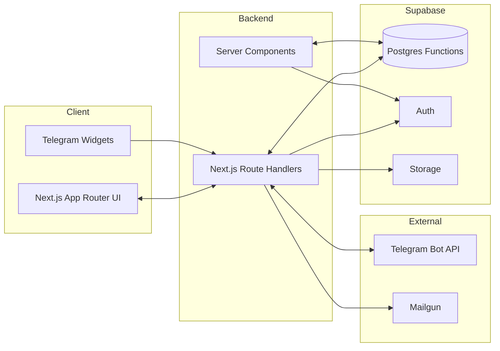
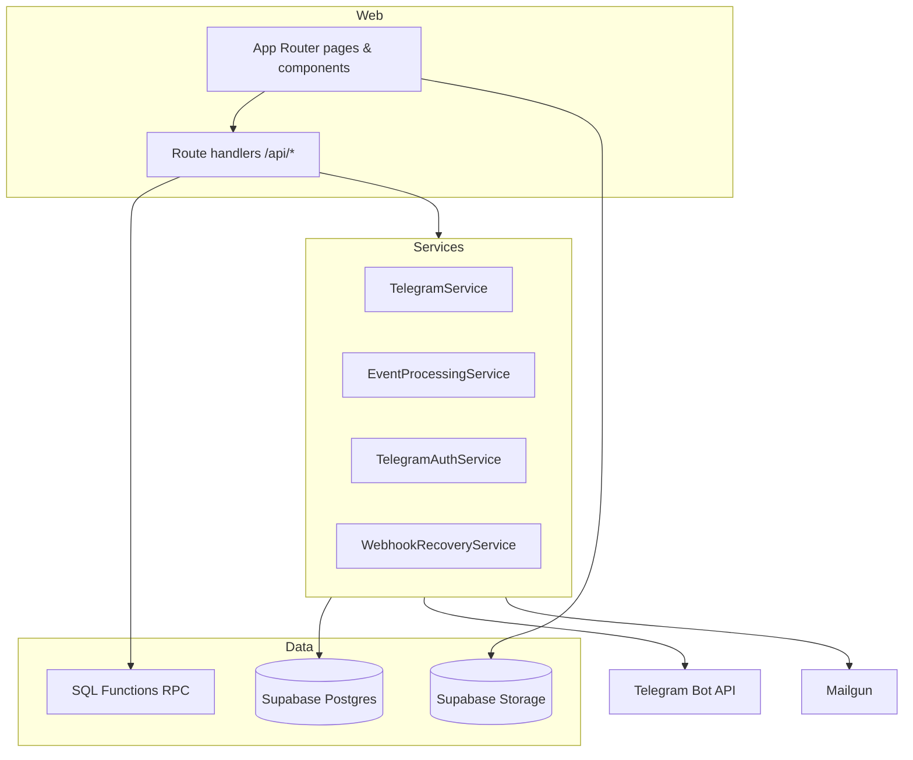
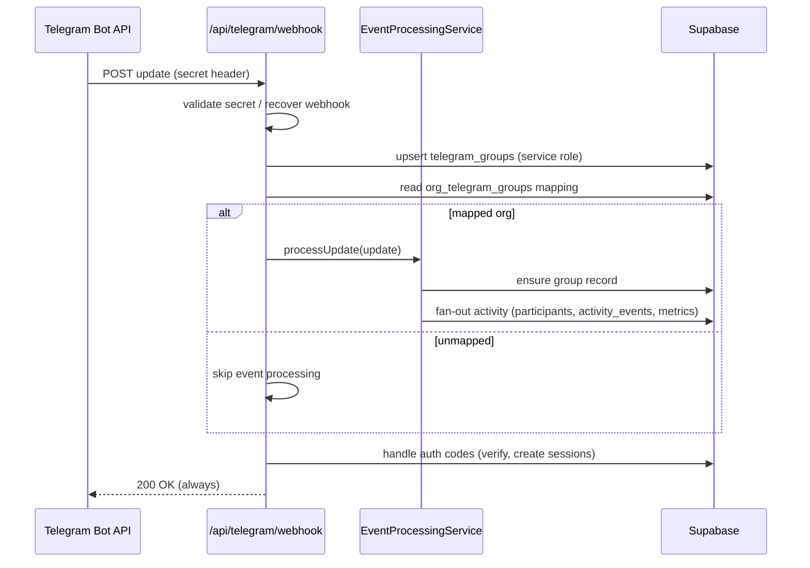

# Orbo 1.1 Functional Audit

_Last reviewed: 2025-02-14_

## 1. Executive Summary
- **Architecture**: Next.js 14 monolith deployed as Vercel-style serverless functions backed by Supabase (Postgres  Auth  Storage). Telegram ingestion, CRM operations, and dashboard APIs all run in-app using service-role Supabase clients for RLS bypass. No background job runner beyond cron-like API routes.
- **Strengths**: Mature Telegram ingestion stack (group discovery, admin sync, activity fan-out), deep participant enrichment, rich dashboard heuristics, and end-to-end event registration  QR check-in flows. Documentation around Telegram ops is extensive.
- **Weaknesses**: Lack of guardrails on service-role usage, missing webhook idempotency and rate protection, manual tenant mapping for groups, and no production-ready billing/payments. Observability (structured logs, metrics, tracing) is virtually absent; CI only provides linting.
- **Opportunities**: Short-term stabilization around Telegram healthchecks, multi-tenant boundaries, and onboarding UX will unlock the roadmap. Mid-term, payments/events analytics and marketplace scaffolding require new services  governance.

## 2. Architecture Overview

### 2.1 System Context

### 2.2 Domain Components

### 2.3 Telegram Update Sequence

## 3. Platform Pillars

| Pillar | What Works | Gaps | Risks |
| --- | --- | --- | --- |
| **Core Infrastructure** | Next.js App Router with Supabase SSR helpers (`createClientServer`) and service-role admin client (`createAdminServer`). Health endpoints exist (`/api/healthz`). | No automated provisioning; secrets loaded via env without vault. No automated schema drift detection. | Service-role keys in runtime contexts expand blast radius. |
| **Multi-tenancy & Auth** | Organizations  memberships enforce RLS; `requireOrgAccess` guards server components and triggers Telegram admin sync via RPC. Telegram login  auth code verification functioning. | Service-role bypass used broadly (participants fetches, dashboard metrics). No tenant-aware rate limits. Org onboarding manual. | Leakage of cross-tenant data if service-role queries not filtered carefully. |
| **Telegram Integration** | Webhook ingestion, group auto-discovery, admin sync RPC, DM auth codes, notification bot endpoints. Manual recovery tool for webhook secret drift. | No dedupe/backpressure after removal of `telegram_updates`. Missing admin permission verification before mapping groups. Rate-limit/backoff is ad-hoc logging only. | Duplicate events, silent failures, Telegram ban risk. |
| **CRM & Membership** | Participants list enriched with Telegram admin info, invite links, duplicate detection endpoint, enrichment flows. | Renewal reminders, membership statuses, and billing linkages missing. Manual tagging (custom attributes) but no automation. | Hard to maintain accurate membership lifecycle; risk of orphaned records. |
| **Events & QR** | Event CRUD, registration route ensures capacity, QR check-in with hash, ICS export, Telegram notifications. | Attendance analytics manual; QR tokens stored in plain text, no offline fallback. No cancellation flows. | Duplicate or brute-force QR tokens; limited observability for attendance failures. |
| **Analytics & Retention** | Dashboard API aggregates group_metrics, events risk heuristics, churn heuristics. Activity chart summarises 14-day window. | Lacks DAU/WAU baseline (counts messages only). No retention cohort export, no silent list segmentation surfaced. | Decisions rely on heuristics without validation, risk of incorrect escalations. |
| **Growth & Marketplace** | Invite system, onboarding checklist, documentation for admins. Marketplace scaffold absent. | No referral mechanics, no extension registration model. Notification bot limited. | Growth features blocked, partner integrations impossible. |
| **Operations** | Extensive runbooks for Telegram  migrations in `/docs`. Cron endpoints for webhook checks and sync. | No structured logging/metrics, no monitoring. CI only runs `next lint`. No automated tests. | Production incidents undetected, regressions slip through. |

## 4. Domain Deep Dive

### 4.1 Multi-tenancy & Auth
- Organizations defined in Postgres with membership RLS; RPC `is_org_member_rpc` used in `requireOrgAccess` guard. Supabase service-role client used for admin operations, including Telegram admin sync via `sync_telegram_admins` RPC.
- Telegram auth: `/api/auth/telegram-code/generate` issues codes, webhook path consumes codes and issues Supabase sessions; DM messaging handled through `createTelegramService`.
- Risk areas: heavy reliance on service-role clients inside request handlers and server components; limited tenant isolation if filters not applied.

### 4.2 Telegram Integration
- Webhook route ensures group record, but leaves `org_id` null until admins link manually. Event processing ensures canonical group record and updates `group_metrics`, `activity_events`, `participant_groups` via RPC functions.
- Background sync triggered on every org access; admin status stored in `telegram_group_admins` / `user_group_admin_status` with TTL. No queue/backoff; logs rely on `console.*`.
- Recovery service resets webhook secret when mismatch occurs. Cron endpoints check webhook status.

### 4.3 Participant CRM
- Participant fetch uses admin client (service role) bypassing RLS to enrich with membership roles and Telegram admin info. Duplicate detection route merges participants via migrations 25/26.
- Custom attributes (JSONB) available; statuses exist but not surfaced in UI beyond filters. No automated renewal or payment ties.

### 4.4 Payments
- No payment provider integration in codebase. `prd.md` references YooKassa/Tinkoff but no implementation. Billing plan column on organizations unused. Manual invites only.

### 4.5 Events & QR
- Event registration ensures participant linking (via Telegram account or email), updates `event_registrations`, and sends Telegram notifications. QR check-in endpoint updates status and logs to `activity_events`. ICS generation provided.
- No rate limiting on QR endpoints; tokens hashed only for check but stored plain, so need hashed storage  TTL.

### 4.6 Analytics & Retention
- Dashboard API aggregates `group_metrics` and `activity_events` for 14-day chart and heuristics (low registration events, churn risk). Onboarding checklist ensures base setup.
- No WAU/DAU separation; silent list heuristics rely on `participant_activity_summary` views (present in migrations 21). Export/reporting absent.

### 4.7 Admin UX & Operations
- Onboarding checklist, Telegram setup pages, invites management. Manual mapping of groups. Documentation heavy but UI lacks step-by-step wizard.
- Cron endpoints for webhook check, user sync; but no scheduling infrastructure—expected to be invoked by Vercel cron.

## 5. Feature Status Table

| Feature | Status | Risk | Recommendation |
| --- | --- | --- | --- |
| Telegram onboarding skeleton | Partial – webhook  group discovery works; manual mapping & no admin permission validation | Bot removal or missing admin rights go unnoticed | Add healthcheck job, admin rights verification, guided UI wizard |
| Multi-tenant role model | Partial – memberships  RPC  admin sync exist | Service-role bypass may leak data; no audit logs | Introduce scoped service tokens, add admin action audit log |
| Participant CRM | Partial – list, invites, enrichment working | No renewal workflow, statuses ad-hoc | Implement membership lifecycle  reminders |
| Payments | Missing | Revenue capture blocked | Integrate YooKassa/Tinkoff with webhook reconcile |
| Events  QR | Partial – CRUD  registration  QR check-in | Tokens stored plain, no analytics | Hash tokens with TTL, build attendance dashboard |
| Retention dashboard | Partial – heuristics exist | Metrics limited to message counts; silent list absent | Add DAU/WAU, churn risk feed, export |
| Marketplace skeleton | Missing | Extensions roadmap blocked | Model extensions  permissions, internal modules first |
| Observability & CI | Missing | Issues undetected; regressions slip | Add structured logging, metrics, tests, CI coverage |

## 6. Immediate Issues (Wave 0 Candidates)
1. **Telegram webhook resilience** – add idempotency keyed by `update_id`, rate-limit/backoff, and DLQ logging table; integrate healthcheck cron.
2. **Tenant safety** – audit service-role usage, introduce scoped RPC wrappers, enforce org filters everywhere, add admin action audit log.
3. **Admin onboarding UX** – implement guided wizard for linking bots, verifying admin rights, and showing health status in UI.
4. **Observability baseline** – structured logging (pino), Supabase edge function metrics, Sentry integration, minimal error alerts.

## 7. Dependencies & External Services
- **Supabase**: Auth, Postgres, Storage. Requires service-role key for admin operations; ensure rotation.
- **Telegram Bot API**: `main` bot for auth  ingestion, optional notification bot. Subject to rate limits (30 rps) and admin permission requirements.
- **Mailgun**: Outbound email for invites and notifications (not heavily used yet).
- **Vercel Cron**: Expected to hit cron endpoints for sync (no configuration stored in repo).

## 8. Documentation & Runbooks
- `/docs` directory contains Telegram setup guides, migration summaries, and PRD references. Runbook (see `docs/Runbook.md`) explains local setup but lacks production deployment steps.

