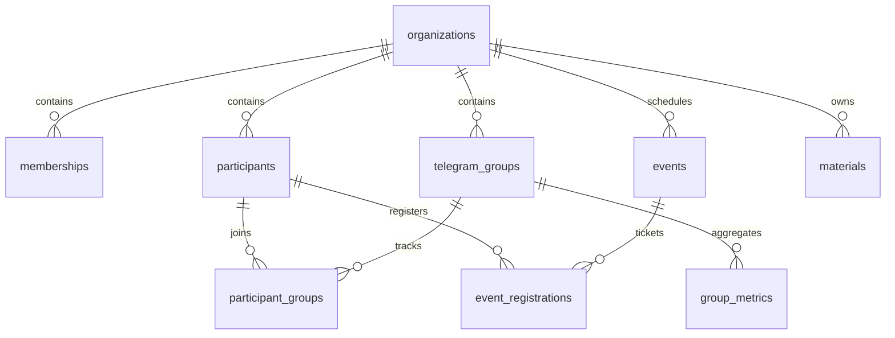

# Database Schema Snapshot (Supabase)

_Last updated: 2025-02-14_

## 1. Core Entities

## 2. Key Tables
| Table | Purpose | Notable Columns |
| --- | --- | --- |
| `organizations` | Tenant container | `id`, `name`, `plan`, `created_at` |
| `memberships` | User roles per org | `org_id`, `user_id`, `role`, `created_at` |
| `telegram_groups` | Canonical chat registry | `id`, `org_id`, `tg_chat_id`, `title`, `bot_status`, `analytics_enabled`, `last_sync_at` |
| `org_telegram_groups` | Many-to-many mapping between orgs and chats | `org_id`, `tg_chat_id`, `status`, `archived_at` |
| `participants` | CRM participant profiles | `id`, `org_id`, `tg_user_id`, `full_name`, `email`, `participant_status`, `custom_attributes`, `merged_into` |
| `participant_groups` | Membership per Telegram group | `participant_id`, `tg_chat_id`, `joined_at`, `left_at` |
| `activity_events` | Activity feed (join/leave/message/checkin) | `id`, `org_id`, `type`, `participant_id`, `tg_chat_id`, `meta`, `created_at` |
| `group_metrics` | Daily aggregates per chat | `org_id`, `tg_chat_id`, `date`, `message_count`, `join_count`, `leave_count` |
| `events` | Events with scheduling metadata | `id`, `org_id`, `title`, `event_date`, `start_time`, `capacity`, `status`, `location`, `description`, `calendar_url` |
| `event_registrations` | RSVP  attendance | `id`, `org_id`, `event_id`, `participant_id`, `status`, `qr_token`, `registered_at` |
| `telegram_group_admins` | Cached admin snapshots | `tg_chat_id`, `tg_user_id`, `is_owner`, `is_admin`, `custom_title`, `expires_at` |
| `user_telegram_accounts` | Linked Telegram identities | `user_id`, `org_id`, `telegram_user_id`, `telegram_username`, `is_verified`, `verified_at` |
| `telegram_auth_codes` | Temporary codes for DM auth | `code`, `telegram_user_id`, `org_id`, `expires_at`, `session_url` |
| `organization_invites` | Invite links for onboarding | `id`, `org_id`, `token`, `role`, `expires_at`, `max_uses` |
| `materials` / `material_items` | Knowledge base (folder  item) | folder tree  doc/file/link metadata |

## 3. Supporting Functions & Views
| Object | Description |
| --- | --- |
| `is_org_member_rpc(org uuid)` | Security-definer RPC to validate membership (used in `requireOrgAccess`). |
| `get_user_role_in_org(p_user_id uuid, p_org_id uuid)` | Returns role string for UI gating. |
| `sync_telegram_admins(p_org_id uuid)` | Syncs Telegram admin cache into memberships/admin status tables. |
| `participant_activity_summary` view | Aggregated activity metrics per participant (joins, messages). |
| `org_dashboard_stats(_org uuid)` | Returns basic counts for dashboard (legacy). |

## 4. Security & RLS
- RLS enabled on core tables (`organizations`, `memberships`, `telegram_groups`, `participants`, `activity_events`, `events`, `event_registrations` etc.). Policies enforce membership by `org_id` with admin-only write access.
- Service-role clients bypass RLS (used in server handlers). Guard by filtering `org_id` explicitly.
- Sensitive operations (e.g., `sync_telegram_admins`) implemented as security-definer SQL functions.

## 5. Upcoming Changes (Recommended)
- **Payments**: Add `subscriptions`, `invoices`, `payment_events` tables with foreign keys to `organizations`.
- **Audit Logging**: New `admin_action_log` (id, org_id, actor_id, action, target_type, target_id, payload JSONB, created_at).
- **Telegram Health**: Add `telegram_webhook_events` (update_id, tg_chat_id, org_id, status, error_code, processed_at).
- **Extensions**: Introduce `extensions`, `extension_installations`, `extension_permissions` for marketplace.

## 6. Migration Hygiene
- Use sequential SQL migrations in `db/migrations`. Latest migrations (40–57) clean up admin sync tables, add unique constraints, and import participant photos. Continue to keep change logs in `/docs` alongside migrations to ease audits.
- When introducing hashed QR tokens, add migration converting existing plaintext tokens and backfilling `qr_token_hash` with safe fallback.
