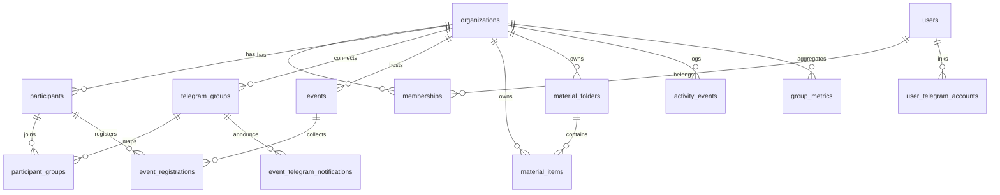

# Database Schema Snapshot — Orbo 1.1 (Nov 2025)

Source of truth: Supabase migrations (`db/migrations/*`). Types in `lib/database.types.ts` are outdated; regenerate after schema changes. Planned additions listed here align with `docs/ROADMAP_FINAL_NOV15_2025.md`.

## 1. Core Entities
| Table | Key Columns | Description |
| --- | --- | --- |
| `organizations` | `id uuid PK`, `name`, `plan` | Tenant/workspace definition. `plan` unused currently. |
| `memberships` | `(org_id, user_id) PK`, `role`, `created_at` | Links Supabase auth user to organization with role (`owner`, `admin`, `member`). |
| `organization_invites` | `id uuid PK`, `org_id`, `email`, `role`, `invite_code`, `expires_at` | Email invites for admins/members. |
| `organization_invite_uses` | `id`, `invite_id`, `user_id`, `used_at` | Tracks invite consumption. |
| `superadmins` | `user_id PK` | Global admin list for `/superadmin` UI. |

## 2. Participants & Activity
| Table | Key Columns | Notes |
| --- | --- | --- |
| `participants` | `id uuid PK`, `org_id`, `tg_user_id`, `full_name`, `email`, `phone`, `participant_status`, `merged_into` | Records members imported from Telegram or created manually. `merged_into` indicates dedupe.
| `participant_groups` | `(participant_id, tg_group_id) PK`, `joined_at`, `left_at` | Many-to-many between participants and Telegram groups. `tg_group_id` references `telegram_groups.tg_chat_id`.
| `participant_messages` | `id`, `participant_id`, `tg_group_id`, `message_count`, `first_message_at`, `last_message_at` | Aggregate message stats per participant/group (from migration 38).
| `participant_merge_history` | `id`, `org_id`, `source_participant_id`, `target_participant_id`, `reason`, `created_at` | Audit merges (logging currently disabled in API).
| `activity_events` | `id`, `org_id`, `event_type`, `tg_chat_id`, `participant_id`, `meta jsonb`, `created_at` | Normalized Telegram events (join/leave/message/checkin). Migration 42 renamed columns (`event_type`).
| `group_metrics` | `id`, `org_id`, `tg_chat_id`, `date`, `message_count`, `join_count`, `leave_count`, `active_members` | Daily aggregates for dashboard heatmaps.

## 3. Telegram Integration
| Table | Key Columns | Notes |
| --- | --- | --- |
| `telegram_groups` | `id serial PK`, `org_id`, `tg_chat_id unique`, `title`, `bot_status`, `last_sync_at`, `analytics_enabled`, `added_by_user_id` | Canonical list of chats. When webhook sees new chat it inserts row with `org_id = null` until mapped.
| `org_telegram_groups` | `id`, `org_id`, `tg_chat_id`, `added_by` | Junction table connecting groups to orgs (with metadata such as `connected_at`).
| `telegram_group_admins` | `id`, `tg_chat_id`, `tg_user_id`, `is_owner`, `is_admin`, `custom_title`, `expires_at` | Cached Telegram admin status (migration 43).
| `user_group_admin_status` | `id`, `user_id`, `tg_chat_id`, `is_admin`, `checked_at` | Tracks whether a Supabase user is admin in Telegram group.
| `telegram_auth_codes` | `code`, `org_id`, `user_id`, `telegram_user_id`, `expires_at`, `consumed_at` | DM verification codes (migration 33).
| `telegram_chat_migrations` | `id`, `old_chat_id`, `new_chat_id`, `migrated_at` | Handles chat migration events (migration 69).
| `telegram_import_batches` | `id`, `org_id`, `status`, `created_at`, `error` | Tracks bulk import jobs (migration 57).
| `telegram_bots` | `id`, `bot_type`, `token`, `status`, `last_health_check` | Optional management table (migration 04).

## 4. Events & Attendance
| Table | Key Columns | Notes |
| --- | --- | --- |
| `events` | `id uuid PK`, `org_id`, `title`, `event_type`, `location_info`, `event_date`, `start_time`, `end_time`, `capacity`, `status`, `is_public`, `created_by`, `updated_at` | Created via UI `/app/app/[org]/events`. Columns `event_date`, `start_time`, `end_time` from migration 19.
| `event_registrations` | `id uuid PK`, `event_id`, `participant_id`, `status`, `registration_source`, `registered_at`, `qr_token` | `qr_token` hashed planned; currently stored plain.
| `event_telegram_notifications` | `id uuid PK`, `event_id`, `tg_group_id`, `notification_type`, `scheduled_at`, `sent_at`, `status`, `error_message` | Cron `/api/cron/event-notifications` manages records.

## 5. Materials & Knowledge Base
| Table | Key Columns | Notes |
| --- | --- | --- |
| `material_folders` | `id uuid PK`, `org_id`, `parent_id`, `name`, `created_at` | Hierarchical tree (depth limited to 3 via `MaterialService`).
| `material_items` | `id uuid PK`, `org_id`, `folder_id`, `kind`, `title`, `content_md`, `file_path`, `url`, `created_by`, `created_at` | `content_md` column introduced after migration 42; ensure types updated.
| `material_access` | `id serial PK`, `org_id`, `item_id`, `participant_id`, `tg_group_id` | Access control entries. Unique constraint on `(item_id, tg_group_id, participant_id)`.

## 6. Auth & Profiles
| Table | Key Columns | Notes |
| --- | --- | --- |
| `profiles` | `id uuid PK`, `full_name`, `username`, `telegram_user_id`, `avatar_url`, `bio` | Mirror of Supabase auth profile (custom table).
| `user_telegram_accounts` | `user_id PK`, `org_id`, `telegram_user_id`, `telegram_username`, `is_verified`, `verification_code`, `verification_expires_at`, `updated_at` | Links Supabase user to Telegram identity per org.
| `user_organizations` (view) | Combines memberships  roles for quick lookup in UI.

## 7. Supporting Tables
| Table | Purpose |
| --- | --- |
| `system_heartbeats` *(planned)* | Wave 0 addition for cron health.
| `admin_action_log` *(planned)* | Wave 0 addition to record admin actions.
| `telegram_update_receipts` *(planned)* | Wave 0 dedupe table for webhook idempotency.
| `subscriptions`, `payment_intents`, `payment_events`, `org_ledger_entries` *(planned)* | Wave 1 payments.
| `extensions`, `extension_installations`, `extension_events`, `extension_api_keys` *(planned)* | Wave 2 marketplace.
| `org_referrals`, `churn_alerts` *(planned)* | Wave 2 growth hooks.

## 8. Relationships Diagram

## 9. Migration Notes
- Migration 42 removed `telegram_updates` (idempotency table) — Wave 0 will introduce replacement `telegram_update_receipts`.
- Migration 43 fixes `telegram_group_admins` schema and introduces TTL for admin cache.
- Migration 69 adds `telegram_chat_migrations` to map supergroup migrations; ensure webhook handles `migrate_to_chat_id` events.
- Migration 73 (per docs) fixed member count triggers; verify deployed state to avoid stale triggers.

## 10. Schema Maintenance Checklist
- [ ] Regenerate `lib/database.types.ts` using `npx supabase gen types typescript ...`.
- [ ] Document new tables in `/docs/Tech-Notes.md` after migrations.
- [ ] Run Supabase migration diff before prod deploys; keep `db/create_tables_now.sql` aligned.
- [ ] Add seeds for local dev (org  Telegram group stub) in `db/demo_data.sql`.

